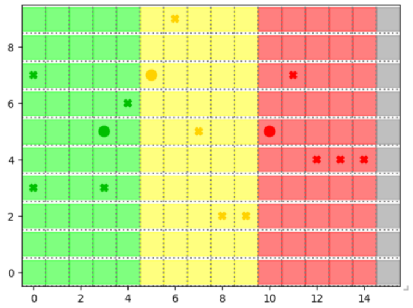
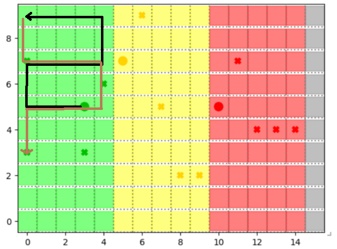
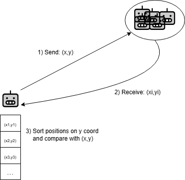
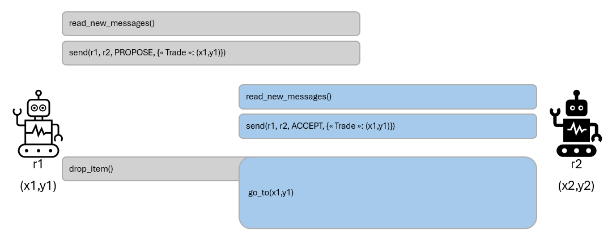

# Simulation de Collecte et Traitement de Déchets Radioactifs

## Description du Projet

Ce projet est une simulation multi-agents qui modélise un environnement où des robots collectent et traitent des déchets radioactifs. L'environnement est divisé en zones de radioactivi té de différents niveaux, et les robots doivent collecter des déchets compatibles avec leur niveau de résistance, les fusionner pour créer des déchets plus toxiques, et les déposer dans une zone de dépôt.

<figure>
  
  <figcaption><em>Figure 1 – Environnement du projet.</em></figcaption>
</figure> 

## Structure du Projet

Le projet est organisé en plusieurs fichiers python :

- `agents.py` : Définit les robots
- `model.py` : Implémente le modèle de simulation
- `objects.py` : Définit les objets présents dans l'environnement (déchets, zone de dépôt, zones radioactives) 
- `utils.py` : Contient des fonctions utilitaires
- `visualization.py` : Gère la visualisation de la simulation
- `main.py` : Point d'entrée de l'application

## Agents et Objets

### Robots

Trois types de robots sont définis, chacun avec un niveau de résistance différent :

1. **GreenRobotAgent** : Niveau de résistance 1 (vert)
2. **YellowRobotAgent** : Niveau de résistance 2 (jaune)
3. **RedRobotAgent** : Niveau de résistance 3 (rouge)

Chaque robot possède :

- Un inventaire pour stocker les déchets collectés
- Une liste de déchets traités prêts à être déposés
- Une politique de déplacement

### Objets

1. **Radioactivity** : Zones de radioactivité de différents niveaux (1, 2, 3)
2. **Waste** : Déchets radioactifs de différents niveaux (1, 2, 3)
3. **DisposalZone** : Zone de dépôt pour les déchets traités

## Collecte et Traitement des Déchets

- Les robots ne peuvent collecter que des déchets de leur niveau de résistance
- Les robots peuvent fusionner deux déchets de même niveau pour créer un déchet de niveau supérieur
- Les robots verts fusionnent deux déchets vert pour en faire un jaune avant de le déposer, les robots jaunes fusionnent deux déchets jaunes pour en faire un rouge et les rouges déposent directement chaque déchet rouge qu'ils trouvent 

## Hypothèses

On considère que chaque robot connait les informations suivante:

- Sa position absolue sur la carte
- Les dimensions de la carte
- Un identifiant permettant de contacter les robots de son niveau
- Un identifiant permettant de contacter les robots du niveau supérieur au sien
- Un capteur permettant d'identifier le contenu des cases adjacentes (voisinage de Moore)

## Critère

L'objectif de cce projet sera d'obtenir une solution permettant d'optimiser le nombre de steps nécessaire afin de vider l'entièreté de la grille de ses déchets.

## Visualisation

La simulation est visualisée à l'aide de Solara, qui fournit :

- Une représentation graphique de la grille avec les agents et les objets
- Un graphique montrant le nombre de déchets restants dans l'environnement
- Des contrôles pour ajuster les paramètres de la simulation

## Paramètres Configurables

- Nombre d'agents de chaque couleur (vert, jaune, rouge)
- Nombre de déchets de chaque niveau

## Comment Exécuter la Simulation

Pour lancer la simulation, exécutez le fichier `main.py`. Une interface web s'ouvrira, permettant de visualiser et de contrôler la simulation.
```bash
solara run first_model.main
```

## Politique de Déplacement sans communication

Chaque robot agit de manière totalement autonome, sans échange d’informations, et couvre sa zone entière.

**Étape 1 : Balayage de la zone**  
- Chaque robot parcourt **l’intégralité** de sa zone en serpentins (alternance bas→haut / haut→bas). 
<figure>
  
  <figcaption><em>Figure 2 – Illustration de la politique de déplacement.</em></figcaption>
</figure> 

**Étape 2 : Ramassage et dépôt**  
1. **Ramassage** : dès qu’un déchet est détecté sur une case adjacente, le robot s’y rend pour le saisir
2. **Conversion des déchets** : Une fois l'inventaire plein, les déchets sont traités et transformés en un déchet de niveau supérieur
3. **Dépôt**: Une fois le déchet traité, le robot se déplace jusqu'à la limite de sa zone afin de le déposer.
   - **Zones verte & jaune** : déposent à ouest de la limite est. 
   - **Zone rouge** : déposent dans l’aire de dépôt  
4. **Prise en charge par le robot de la zone supérieur**: Les robots de niveau n+1 ont accès à la colonne la plus à l'Est de la zone n de sorte à pouvoir récupérer les déchets traités par les robots de niveau inférieur. 

> **Note :**  
> - Il n’y a ni découpage en sous‑zones, ni phase terminale coordonnée ; chaque robot continue seul jusqu’à épuisement des déchets dans sa zone.
> - Il y a des cas où la simulation ne peut pas être terminée.  
>   Exemple : S'il n'y a plus de déchets verts au sol et que deux robots de la zone verte ont chacun un déchet vert dans leur inventaire.  

## Politique de Déplacement avec communication

Les robots suivent une stratégie déterministe en trois phases :

**Étape 1 : Répartition en sous‑zones**
On va découper chaque zone en sous-zones de largeur égales. On a donc $z_i \in [0,w[ \times [i*h/n_{robots},(i+1)*h/n_{robots}[$
Chaque robot va commencer par une phase d'initialisation durant laquelle il va:
- Broadcast sa position à tous les robots de sa zone
- Attendre de recevoir la position de chaque autre robot
- Déterminer sa sous-zone en triant les coordonnées des autres robots
- Se déplacer vers le centre de sa sous-zone

<figure>
  
  <figcaption><em>Figure 3 – Schéma de communication pour déterminer la sous-zone.</em></figcaption>
</figure>

L'idée du partage en sous-zone est de minimiser le recouvrement entre les robots afin de leur permettre d'explorer l'entièreté de la zone en un temps minimal. Cette méthode permet de diviser par le nombre de robot le temps requis pour explorer l'entièreté d'une zone dans le pire des cas.

**Étape 2 : Parcours en serpentins et collecte**  
1. **Mouvement en serpentins**  
   - Dans sa sous‑zone, chaque robot balaie les lignes en serpentins (alternance bas→haut puis haut→bas). 
2. **Ramassage**  
   - Si un déchet apparaît sur une case adjacente à sa position (et dans sa sous‑zone), le robot s’y rend au pas suivant pour le saisir.  
3. **Dépôt**  
   - Dès que son inventaire est plein, le robot se dirige vers l’ouest :  
     - **Zones verte et jaune** : dépose le déchet sur la case située juste à l'ouest de la frontière est de leur zone et envoie cette position aux robots de la zone supérieur
     - **Zone rouge** : transporte son déchet jusqu’à l’aire de dépôt.  
4. **Accès aux zones**  
   - **Vert** : uniquement à sa propre zone.  
   - **Jaune et rouge** : à leur zone plus la colonne immédiatement à ouest de leur frontière (pour récupérer les déchets largués par les zones plus à l'ouest).
   Lorsque les robots ont terminé la récolte dans leur propre sous-zone, ils vont chercher les déchets laissés par les robots de niveau inférieur à la frontière de leur propre sous-zone.
**Étape 3 : Phase terminale de chaque zone**  
Chaque robot possède dans sa mémoire une carte appelée "potential_wastes". Au début de l'exploration, chaque case de la sous zone d'un robot peut potentiellement contenir un déchet. A mesure que le robot explore sa sous zone, il met à jour sa carte en excluant la possibilité de trouver des déchets là où il a pu observer une case vide. Une fois l'entièreté de sa sous-zone explorée, le robot entre dans sa phase terminale:

- Si son inventaire est vide, qu'il n'a aucun déchet à aller chercher dans une zone inférieure et que les robots de la zone inférieur ont fini leur mission, le robot à fini sa mission et il s'arrête
- Si son inventaire est rempli et que les robots de la zone inférieur ont fini leur mission, ilentame le protocole d'échange:
   1. Check sa boite aux lettres pour savoir si un robot de sa zone a déjà proposé un échange:
      - si oui:
         Envoyer un message à ce robot pour accepter l'échange
      - sinon:
         Broadcast un message de proposition d'échange à tous les robots de sa zone, en donnant sa position actuelle comme position d'échange.
   
   2. 
      - Si le robot a initié l'échange et reçu un message d'acceptation: il dépose son déchet au sol
      - Si le robot a accepté l'échange, il se rend aux coordonnées de l'échange pour récolter le déchet.

<figure>
  
  <figcaption><em>Figure 4 – Schéma de communication liée aux échanges.</em></figcaption>
</figure>


## Comparaison des résultats sans ou avec communication

La version finale de l’**algorithme sans communication** correspond à la branche part1-no-comm. La version finale de l’**algorithme avec communication** correspond au dernier commit de la branche master.

Le premier **avantage** de l’algorithme avec communication est de résoudre certaines situations qui empêchent les robots de finir leur tâche.

**Exemple :**  
Lorsqu’il n’y a plus de déchets au sol mais que certains robots d’une même zone ont un seul déchet, l’algorithme avec communication permet de résoudre ce problème (Étape 3) alors que celui sans communication ne le permet pas.

Le second avantage de la communication est qu’elle permet d’attribuer des sous‑zones aux robots au début de la simulation, ce qui accélère le ramassage des déchets.

Comme l’algorithme sans communication ne permet pas toujours aux robots de déposer tous leurs déchets dans la zone de dépôt, on ne le comparera pas en nombre total de steps pour vider la zone de dépôt.  
Les algorithmes seront plutôt comparés sur le nombre de steps nécessaires pour qu’il n’y ait plus de déchet au sol, afin de mesurer l’impact de la répartition des robots dans des sous‑zones grâce à la communication.

**Résultats par situation**

**1ère situation : 2 robots par zone, 4 déchets par zone**

| Méthode            | Run 1 | Run 2 | Run 3 | Run 4 | Run 5 | Moyenne |
|--------------------|:-----:|:-----:|:-----:|:-----:|:-----:|:-------:|
| Avec communication |  60   |  57   |  53   |  70   |  47   |  57,4   |
| Sans communication |  75   |  60   |  60   |  55   |  50   |  60,0   |

**2e situation : 3 robots par zone, 4 déchets par zone**

| Méthode            | Run 1 | Run 2 | Run 3 | Run 4 | Run 5 | Moyenne |
|--------------------|:-----:|:-----:|:-----:|:-----:|:-----:|:-------:|
| Avec communication |  25   |  30   |  26   |  25   |  26   |  26,4   |
| Sans communication |  37   |  50   |  30   |  39   |  32   |  37,6   |

**3e situation : 3 robots par zone, 8 déchets par zone, petite carte (15x10)**

| Méthode            | Run 1 | Run 2 | Run 3 | Run 4 | Run 5 | Moyenne |
|--------------------|:-----:|:-----:|:-----:|:-----:|:-----:|:-------:|
| Avec communication |  56   |  50   |  47   |  48   |  50   |  50,2   |
| Sans communication |  60   |  69   |  71   |  50   |  69   |  63,8   |

**4e situation : 4 robots par zone, 8 déchets par zone, petite carte (15x10)**

| Méthode            | Run 1 | Run 2 | Run 3 | Run 4 | Run 5 | Moyenne |
|--------------------|:-----:|:-----:|:-----:|:-----:|:-----:|:-------:|
| Avec communication |  23   |  43   |  36   |  40   |  39   |  36,2   |
| Sans communication |  37   |  48   |  43   |  51   |  43   |  44,4   |

**5e situation : 3 robots par zone, 8 déchets par zone, grande carte (30x30) [NF = Non Fini]**

| Méthode            |  Run 1 |  Run 2 |  Run 3 | Moyenne |
|--------------------|:------:|:------:|:------:|:-------:|
| Avec communication |  185   |  175   |  197   |  185.7  |
| Sans communication |  240 NF|  321 NF|  307 NF|  289.3  |

On constate que dans **toutes** les configurations, l’algorithme **avec communication** atteint systématiquement un nombre de steps **inférieur** à celui **sans communication**, avec un gain moyen particulièrement marqué dès que le nombre de robots ou de déchets augmente. Cela confirme l’efficacité de la répartition en sous‑zones et de la coordination entre robots. De plus, on remarque que sur la grande carte la méthode sans communication ne parvient pas à terminer le travail. En effet, sans communication pour permettre les échanges, on se retrouve coincé dans une situation où les seuls déchets présents dans l'environnement sont dans l'inventaire non rempli de robots.

## Auteurs

- Vogels Arthur
- Pierre Glerant

## Date

20/04/2025
